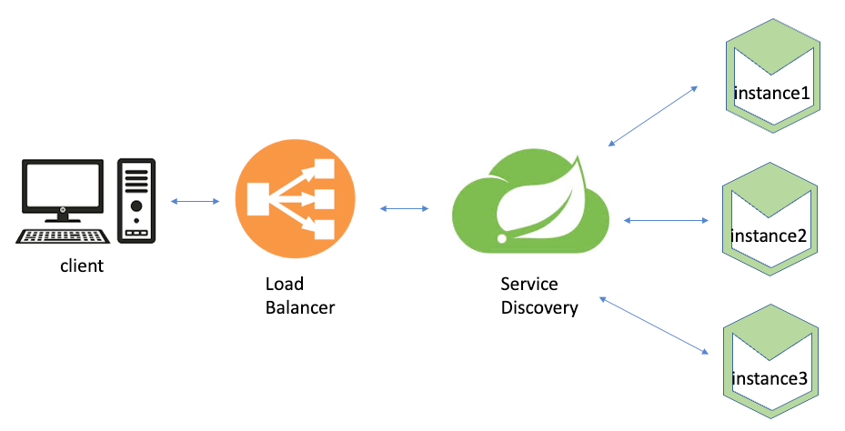

# SPRING CLOUD NETFLIX EUREKA
Is a client-side service discovery
Service Discovery & Service Registration allows services to find and communicate with each 
other without hard-coding the hostname and port through an architecture that is service registry, with which each 
service has to register.

Eureka Client
- accounts/controller/CustomController
  - /fetchCustomerDetails

Feign Client (REST-consuming web application)
- accounts/service
  - CardsClient
  - LoansClient

Config of Eureka Server to Registry Services
- accounts/src/main/resources/application.yml

This configuration must be in all microservices to be registered on the eureka server.

Official Documentation:
[Spring Cloud Netflix Eureka](https://www.baeldung.com/spring-cloud-netflix-eureka)

